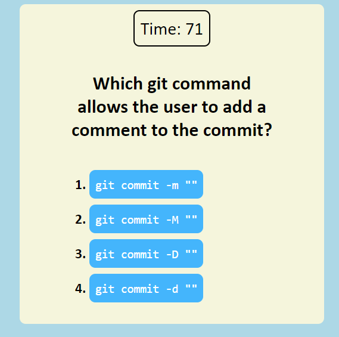

#Coding Quiz

## Description

This repo was made to make a short quiz about web programming. It's made with HTML, CSS, and JavaScript. The quiz asks the user to answer a certain amount of questions, and the user has to answer them all within the timer.

The user gets points for every correct answer, but loses time for every incorrect answer. The game ends when the user answers all the questions or time runs out. At the end of the screen the user is prompted to enter their initials for the scoreboard. The scoreboard is saved locally in the *browser* so even after leaving or refreshing the site, the scores will persist.

The focus of this repo was to practice creating, adding, and editing HTML elements through JavaScript. While there is HTML and CSS code written, the answers are dynamically populated! A code snippet can be found [below](#dynamically-populate-li-elements)

Deployment link is found here: [https://nathangero.github.io/coding-quiz/](https://nathangero.github.io/coding-quiz/)

## Learning Points

* It takes lots of practice to get use to creating and adding HTML elements via JavaScript.
* Sorting an object by decesnding values is not easy, but it was necessary for the scoreboard.
* Manipulating timers and event listeners is difficult at first but makes organzing code a lot easier.
* Organizing code by functions that have one purpose takes some thinking. It took time to realize how create functions that took in the right arguements and return the right output to have more organized code.
* Using "enums" via const objects was extremely useful in choosing the questions and their respective correct answers and multiple choice answers. Numbers (0, 1, 2 ,3, etc.) were used as the object keys and  question/answer as the values.
* Combining CSS with JavaScript, e.g.: ```element.setAttribute("style", "display: none");```, was useful. I could define certain styling for a class/id/element with CSS, and then dynamically make it hidden/visible via JavaScript.

## Code Snippets

### Randomizing answers

This randomly chooses the answers for a given question. So every new round of the quiz is different.
```js
var answersDeepCopy = JSON.parse(JSON.stringify(MULTIPLE_CHOICE[question]));
var answersLength = Object.keys(answersDeepCopy).length;

for (var i = 0; i < Object.keys(MULTIPLE_CHOICE[question]).length; i++) {
    
    var randomIndex = (answersLength > 0) ? Math.floor(Math.random() * answersLength) : 0; // If only one answer is left, pick the first answer
    var questionKey = Object.keys(answersDeepCopy)[randomIndex];
    var answer = answersDeepCopy[questionKey];
    delete answersDeepCopy[questionKey]; // Delete answer used to prevent duplicates
    answersLength = Object.keys(answersDeepCopy).length; // Update so Math.random() doesn't go out of bounds

    /* Then dynamically populate li elements */
}
```

### Dynamically populate li elements

Depending on how many answers each question has, it will create the appropriate amount of li elements. So when the site has a True/False question, it'll only populate 2 li elements vs. the usual 4.
```js
for (var i = 0; i < Object.keys(MULTIPLE_CHOICE[question]).length; i++) {
    /* First randomize answers */

    if (answer === "") { // If the answer is empty, skip it
        continue;
    }

    var liButton = document.createElement("button");
    liButton.innerHTML = answer;
    liButton.addEventListener("click", onAnswerClick); // Add on click listener

    var li = document.createElement("li");
    li.appendChild(liButton);
    li.setAttribute("data-index", i);

    quizAnswerContainer.appendChild(li);
}
```


### Sorting highscores

This code was found [here](https://codereview.stackexchange.com/a/245007).
This solution uses creative use of back-to-back higher order functions of ```.sort()``` and ```.reduce()```
```js
function sortScoresDescending(scores) {
    var sortedScores = Object.keys(scores)
    .sort((a, b) => scores[b] - scores[a]) // Sort value descending
    .reduce((acc, cur) => { // Put the new sorting into an object.
        acc[cur] = scores[cur]
        return acc
    }, {})

    return sortedScores;
}
```

## Photos

Example of answers being randomized

<br>

<br>


## Credits

### Code Resources

[Dynamically add scores](https://git.bootcampcontent.com/University-of-California---Berkeley/UCB-VIRT-FSF-FT-09-2023-U-LOLC/-/blob/main/course-content/04-Web-APIs/activities/26-Stu_Local-Storage-Todos/Unsolved/assets/js/script.js)

[Sorting object by its values](https://codereview.stackexchange.com/a/245007)

### Resources

[stopPropagation() definition](https://developer.mozilla.org/en-US/docs/Web/API/Event/stopPropagation)

[toggleAttribute() docs](https://developer.mozilla.org/en-US/docs/Web/API/Element/toggleAttribute)

[removeChild() docs](https://developer.mozilla.org/en-US/docs/Web/API/Node/removeChild)

[Local Storage docs](https://developer.mozilla.org/en-US/docs/Web/API/Window/localStorage)

[for...in docs](https://developer.mozilla.org/en-US/docs/Web/JavaScript/Reference/Statements/for...in)

[Deep copy objects docs](https://developer.mozilla.org/en-US/docs/Glossary/Deep_copy)

[Force uppercase docs](https://developer.mozilla.org/en-US/docs/Web/CSS/text-transform)